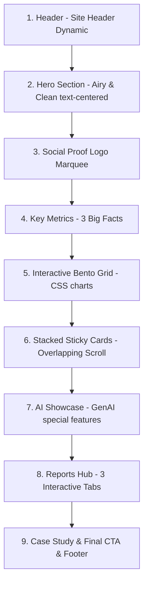

# Smax Feature Page Playbook (Quy chuẩn Nhân bản Trang tính năng Smax)

Tài liệu này lưu trữ toàn bộ kế hoạch triển khai, cấu trúc thiết kế và quy chuẩn kỹ thuật đã hoàn thiện trên trang mẫu **Smax Livechat** để làm khuôn mẫu nhân bản cho 7 phân hệ tính năng còn lại của Smax.

---

## 📋 1. Cấu Trúc Layout Chuẩn (Standard Wireframe)

Mỗi trang giới thiệu phân hệ tính năng của Smax khi nhân bản phải đi qua tuần tự 9 section dưới đây để đảm bảo tính nhất quán về mặt nhận diện thương hiệu và tối ưu tỷ lệ chuyển đổi (CRO):



---

## 🎨 2. Quy Chuẩn Thiết Kế Chi Tiết & Code Snippets

### Section 1: Hero Section (Thoáng đãng & Hiện đại)
* **Quy chuẩn:** Căn giữa hoàn toàn (Centered layout), không sử dụng các hình ảnh 3D lộn xộn đè lên nhau.
* **Hình nền (Background):** Sử dụng lưới grid tinh tế kế thừa từ phong cách PrebuiltUI qua ảnh nền `https://raw.githubusercontent.com/prebuiltui/prebuiltui/main/assets/hero/gridBackground.png`.
* **Badge thông báo (Announcement Badge):** Thay thế cho tag chấm tròn cũ. Dùng dạng viên thuốc `.announcement-badge` có nút hành động trỏ link docs mượt mà.
* **Nút hành động (CTA Buttons):** Sử dụng nút bo tròn hoàn toàn `border-radius: 99px` (rounded-full) với kích thước `14px 32px` tạo cảm giác cực kỳ công nghệ, hiện đại.
* **Snippet HTML:**
```html
<section class="premium-hero">
  <div class="hero-grid-bg"></div>
  <div class="container">
    <div class="announcement-badge">
      <span class="announcement-tag">NEW</span>
      <span>[Tên phân hệ hoặc Tagline]</span>
      <a href="https://docs.smax.ai" target="_blank" class="announcement-link">
        <span>Đọc thêm</span>
        <svg width="14" height="14" viewBox="0 0 24 24" fill="none" stroke="currentColor" stroke-width="2.5" stroke-linecap="round" stroke-linejoin="round">
          <path d="M5 12h14M12 5l7 7-7 7"/>
        </svg>
      </a>
    </div>
    <h1>[Tiêu đề chính nổi bật] <span class="highlight">[Highlight thương hiệu]</span></h1>
    <p class="hero-sub">[Mô tả ngắn gọn và cuốn hút trong vòng 2-3 dòng]</p>
    <div class="hero-actions">
      <a class="btn btn-dark" href="#cta" style="background: var(--primary-navy, #0F1835); border-color: var(--primary-navy, #0F1835);">Đăng ký tư vấn</a>
      <a class="btn btn-soft" href="https://docs.smax.ai" target="_blank" style="border: 1px solid rgba(15, 24, 53, 0.15); background: transparent; color: var(--primary-navy, #0F1835);">Trải nghiệm miễn phí</a>
    </div>
  </div>
</section>
```

### Section 2: Key Metrics (Số liệu thực chứng)
* **Quy chuẩn:** Nền xám nhạt `#F8F9FC`. Chia làm 3 cột số liệu lớn để tăng độ tin cậy.
* **Snippet CSS:**
```css
.metrics-section { padding: 80px 0; background: #F8F9FC; }
.metrics-grid { display: grid; grid-template-columns: repeat(3, 1fr); gap: 40px; text-align: center; }
.metric-value { font-size: clamp(3rem, 6vw, 4.5rem); font-weight: 900; color: var(--process-blue, #4277FF); line-height: 1; margin-bottom: 16px; }
```

### Section 3: Interactive Bento Grid (3 Thẻ - Đồ họa CSS phẳng)
* **Quy chuẩn:** 1 thẻ rộng full ngang hiển thị Mockup mô phỏng (ví dụ: màn hình chat, sơ đồ luồng) + 2 thẻ rộng 1/2 hiển thị các báo cáo phẳng vẽ bằng CSS/SVG (Biểu đồ cột ngang hoặc Donut Chart).
* **Bento CSS:**
```css
.bento-features-grid { display: grid; grid-template-columns: repeat(2, 1fr); gap: 30px; }
.bento-item { background: #FFFFFF; border-radius: 24px; padding: 40px; border: 1px solid rgba(15, 24, 53, 0.05); }
.bento-item.full-width { grid-column: span 2; display: flex; align-items: center; gap: 60px; }
```

### Section 4: Stacked Sticky Cards (Overlapping Sticky Scroll)
* **Quy chuẩn:** Đây là phần quan trọng nhất để tạo trải nghiệm cuộn độc đáo. Các thẻ tính năng sẽ dính ở trên đầu và xếp chồng đè nhẹ lên nhau so le.
* **Tọa độ Top & Z-Index:** Mỗi thẻ cách nhau `30px` để lộ mép thẻ trước đó.
  * Thẻ 1: `top: 110px`, `z-index: 1`, `background: #4277FF`
  * Thẻ 2: `top: 140px`, `z-index: 2`, `background: #FA6E5B`
  * Thẻ 3: `top: 170px`, `z-index: 3`, `background: #0F1835`
  * Thẻ 4: `top: 200px`, `z-index: 4`, `background: #12B76A` (Màu xanh lục lá cây)
  * Thẻ 5: `top: 230px`, `z-index: 5`, `background: #6941C6` (Màu tím công nghệ AI)
* **Kích thước cố định (Quan trọng):**
  * Thẻ: `height: 440px`, `padding: 48px 64px`, `grid-template-columns: 1.25fr 1fr` (ảnh nhỏ hơn chữ).
  * Khung chứa ảnh: `height: 320px; overflow: hidden;`
  * Ảnh bên trong: `width: 100%; height: 100%; object-fit: cover; object-position: top left;`


### Section 5: FAQ Accordion Section (Câu hỏi thường gặp)
* **Quy chuẩn:** Đặt giữa section Feedback (Case Study) và section CTA. Sử dụng cấu trúc Accordion cuộn mở mượt mà bằng CSS & JS.
* **Định dạng:** 
  - Nền xám nhạt hoặc trắng, các câu hỏi chứa trong các box `.faq-item` bo tròn `16px`.
  - Icon bên phải là dấu cộng (+) xoay xoay `45deg` thành dấu nhân (x) khi mở ra bằng hiệu ứng CSS transition.
  - Cắt nội dung câu trả lời tự động bằng việc thay đổi `max-height` động qua JavaScript (`scrollHeight`) để đảm bảo hiệu ứng trượt trơn tru.
* **Snippet HTML:**
```html
<section class="faq-section">
  <div class="container">
    <div class="section-header">
      <h2>Câu hỏi thường gặp về Smax [Tên phân hệ]</h2>
      <p>[Mô tả ngắn gọn về phạm vi giải đáp của phân hệ]</p>
    </div>
    <div class="faq-container">
      <div class="faq-item">
        <button class="faq-trigger" type="button">
          <span>[Câu hỏi thường gặp 1]</span>
          <div class="faq-icon-wrapper">
            <svg viewBox="0 0 24 24" fill="none" stroke="currentColor" stroke-width="3" stroke-linecap="round" stroke-linejoin="round">
              <line x1="12" y1="5" x2="12" y2="19"></line>
              <line x1="5" y1="12" x2="19" y2="12"></line>
            </svg>
          </div>
        </button>
        <div class="faq-content">
          <div class="faq-content-inner">
            [Câu trả lời chi tiết và rõ ràng]
          </div>
        </div>
      </div>
      <!-- Lặp lại tối đa 6 câu hỏi -->
    </div>
  </div>
</section>
```

### Section 6: Final CTA & Footer (Đồng bộ trang chủ)
* **Quy chuẩn:** Kế thừa nguyên vẹn style `.final-cta` và `.cta-inner` từ trang chủ. Tuyệt đối không dùng inline style làm tối nền hoặc chèn màu trắng chữ thủ công để tránh việc card `.cta-inner` bị biến thành hộp màu xám xỉn trên nền tối.
* **Snippet HTML:**
```html
<section class="final-cta" id="cta">
  <div class="container cta-inner">
    <h2>[Tiêu đề hành động]</h2>
    <p>[Subtext kêu gọi ngắn gọn]</p>
    <div class="cta-actions">
      <a class="btn btn-dark" href="#top">Dùng thử miễn phí</a>
      <a class="btn btn-soft" href="index.html#cta">Đặt lịch hẹn tư vấn</a>
    </div>
  </div>
</section>
```

---

## ⚠️ 3. Các Bẫy Kỹ Thuật Cần Tránh (CSS/JS Traps)

1. **Vô hiệu hóa Sticky do `overflow`:**
   * **Bẫy:** Bất kỳ thẻ cha hoặc wrapper bao ngoài nào (ví dụ `.livechat-page-wrapper`) có thuộc tính `overflow-x: hidden;` hoặc `overflow: hidden;` đều sẽ làm **vô hiệu hóa hoàn toàn** hiệu ứng `position: sticky`.
   * **Giải pháp:** Không đặt `overflow-x: hidden` trên wrapper. Chuyển nó trực tiếp lên thẻ `body`:
     ```css
     body { overflow-x: hidden; }
     ```

2. **Ảnh Screenshot quá to làm vỡ Card:**
   * **Bẫy:** Không giới hạn chiều cao ảnh khiến các ảnh screenshot từ Smax đẩy chiều cao card lên `600px - 700px`, gây tràn viewport và đè mất các thẻ trước.
   * **Giải pháp:** Luôn cố định chiều cao `.stacked-card` là `440px` và `.stacked-card-media` là `320px`, áp dụng `object-fit: cover` để ảnh tự động co dãn tinh tế.

3. **Chuyển tab Báo cáo mượt mà:**
   * Sử dụng JS gọn nhẹ để toggle class `.active` cho tab button và các panel ảnh báo cáo mà không cần tải lại trang.

---

## 🚀 4. Kế Hoạch Nhân Bản Cho Các Trang Tiếp Theo

| Phân hệ | Mẫu Ảnh Screenshot Cần Dùng | Màu sắc Stacked Cards |
|---------|-----------------------------|-----------------------|
| **Chatbot** | Ảnh cấu hình kịch bản block, sơ đồ hội thoại, nút tương tác | Xanh dương -> Coral -> Navy |
| **GenAI** | Trình cấu hình Prompt AI, Huấn luyện Bot bằng file, AI Agent | Tím -> Xanh -> Navy |
| **AI Insight** | Biểu đồ khách hàng, báo cáo tăng trưởng, phân tích từ khóa | Xanh dương -> Lá cây -> Navy |
